# COM3504-Team30

## Video Walkthrough
A video walkthrough of our project can be found [here](https://www.youtube.com/watch?v=dQw4w9WgXcQ)

## Prerequisites

Before you begin, ensure you have met the following requirements:

- Node.js installed on your machine. You can download it [here](https://nodejs.org/).
- MongoDB installed and running. You can download it [here](https://www.mongodb.com/try/download/community).

## Installation

To install this project, follow these steps:

1. Download the repository:
2. Navigate into the project directory:
```bash
cd project
```

3. Install dependencies:
```bash
npm install
```

## Usage
To run the project, use the following command:
```bash
npm start
```
This will start the server, and you should see a message indicating the server is running on a specific port (usually port 3000 by default).
Visit localhost:3000 to see the app.

## List of Pages
### View all plant sightings page
- View, Add, Sort, and Filter plant sightings
- Map view of the sightings
### Individual plant page
- View full details of a plant sighting
- Edit a plant sighting (Only if Identification is in progress)
- Chat to discuss identification (Only if Identification is in progress)
- Add Identification (Only for the sighting creator)

## List of features
### Logging in / out
- When a user first opens the project, they are presented with a modal to log in with
{image of login modal here}
- Once logged in, a user can access the rest of the features of the website, detailed below
- A user can log out by clicking the ``Logout’’ button
### Adding a plant
- For the sighting's location, you can use your current geolocation or pick a location from a map
- Adding an image for a sighting can be done by selecting an image from your files, taking a picture from your camera (mobile only) or providing a link to an image file.
### Editing a plant
- Users can edit all attributes of a plant sighting while identification is in progress
### Identifying a plant
- Once the correct scientific name of a plant sighting is added, information from DBPedia is used to update the plant's details. 
### Chatting
- Users can use the chat feature to communicate with the sightings creator to help identify the plant
- The plant's creator receives chat notifications
### View Plant(s)
- Show all plants and individual page
- Show plants on a map using Leaflet and OpenStreetMap
- Users can filter plants by their identification status, their properties, and their exposure to sun
- Users can sort the plants by the date they were added and the distances from the user.
### Responsiveness
Great care was taken to ensure the app works well (and looks good) at any screen size. For example, through careful use of CSS breakpoints, the UIs for mobile and desktop look drastically different - with the desktop site looking like a native desktop application and the mobile site looking like a native mobile application. Furthermore, to better user experience even more, a dark/light theme toggle was added, enabling users to choose the style that they are most comfortable with.

Below are screenshots of the main pages on mobile and desktop (and with both colour schemes) (click to expand; alternatively, full-size images can be found in `readme-imgs`).

| 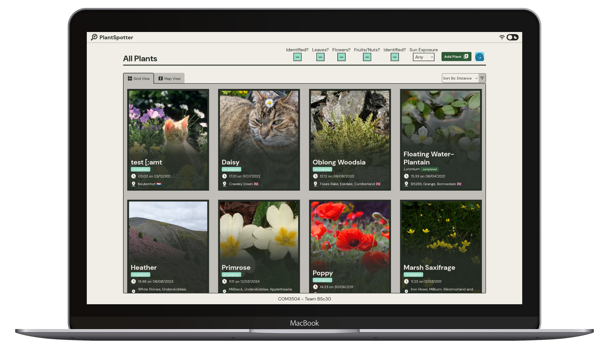 | 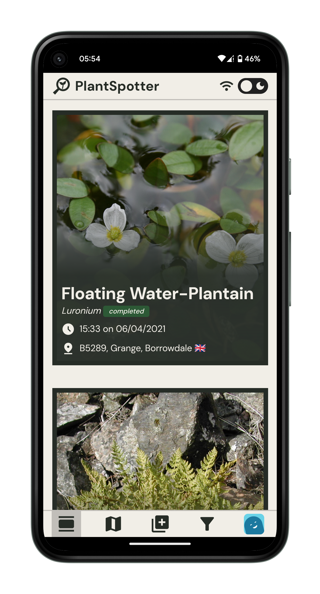 |
|---------------------------------------------------------|---------------------------------------------------------|

|  | 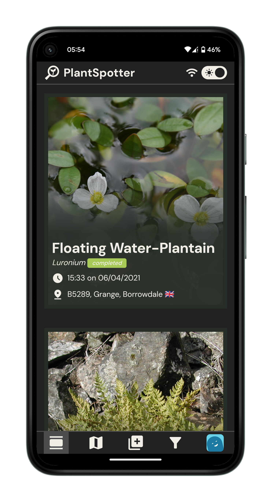 |
|--------------------------------------------------------|--------------------------------------------------------|

|  | 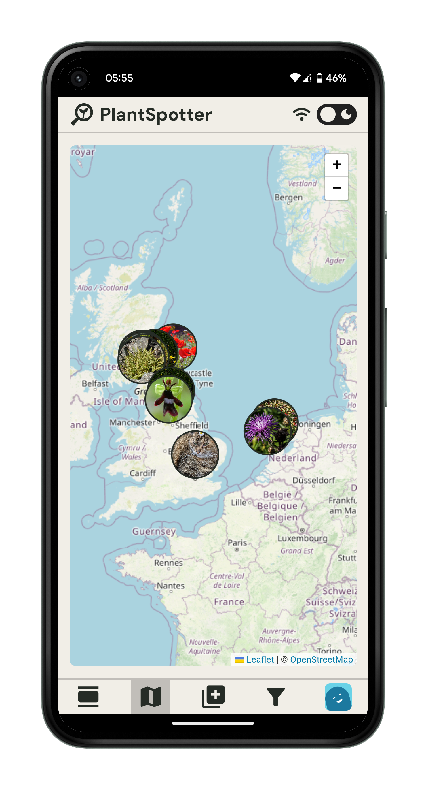 |
|--------------------------------------------------------|--------------------------------------------------------|

| 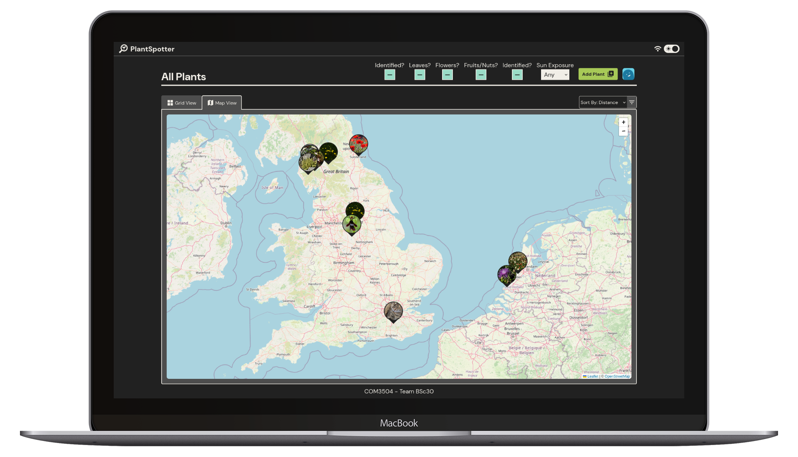 | 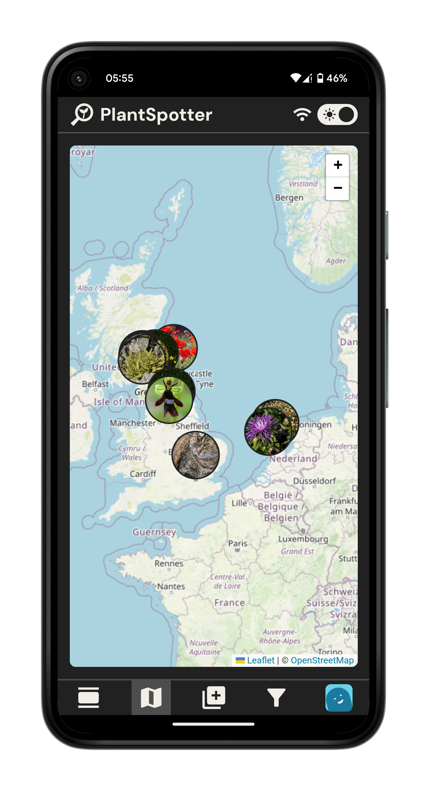 |
|-------------------------------------------------------|-------------------------------------------------------|

| 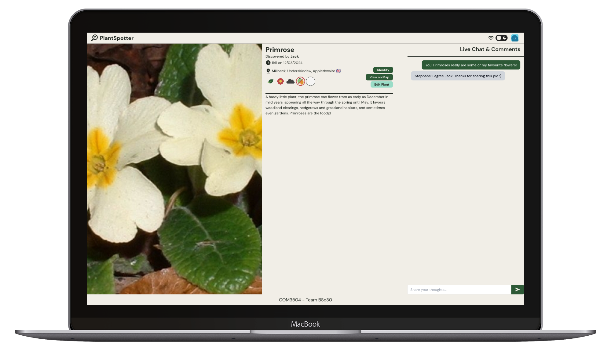 | 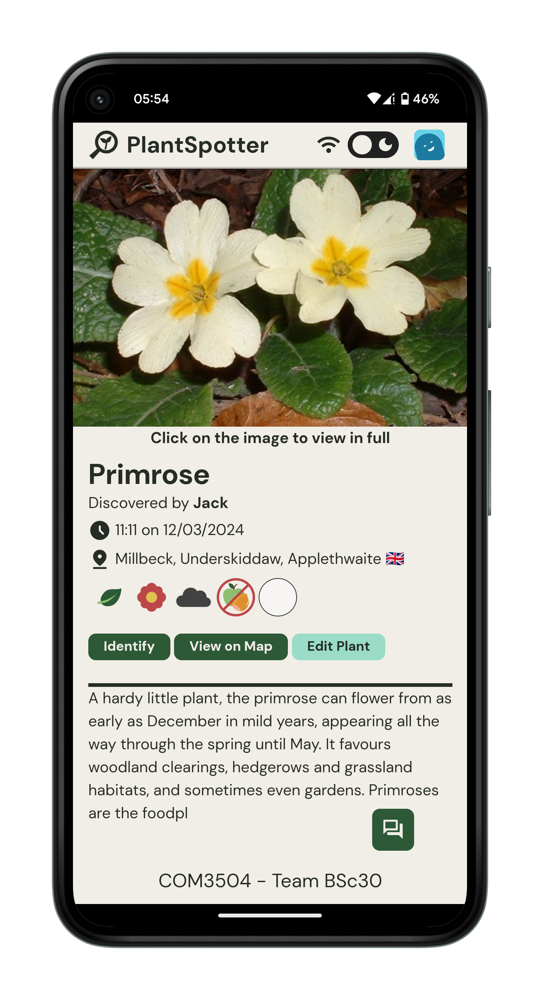 |
|----------------------------------------------------------|----------------------------------------------------------|

| 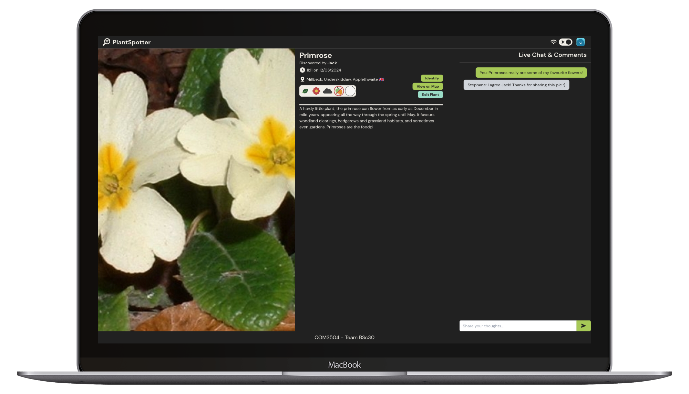 | 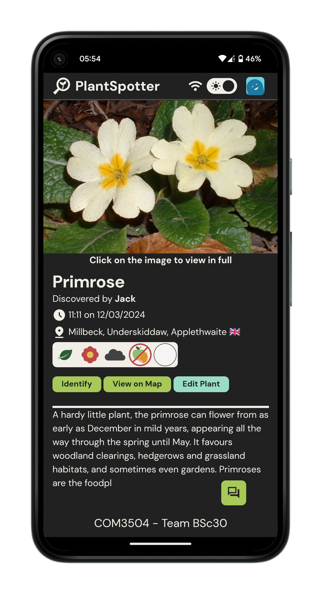 |
|---------------------------------------------------------|---------------------------------------------------------|

### Progressive Web App
- The app can be downloaded as a PWA app and used offline, with changes made offline syncing when a user goes online and vice versa.

Synchronisation was not done utilising the background sync API, as was recommended. The reason for this is that this API is not supported on non-Chromium browsers (Firefox and Safari are the main ones), which alienates a sizeable proportion of the global population - according to [StatCounter.com](https://gs.statcounter.com/browser-market-share), these browsers have a combined ~20% market share, meaning 1 in 5 people would not be able to use the app if the background sync API were to be used. This number is likely to be higher, given the popularity of Apple devices and the fact that any browser downloaded onto an Apple device must run on Apple's own WebKit browser engine (which, as mentioned earlier, does not support the background sync API).

In place of the background sync API, a custom synchronisation handler was created. This handler is fast, easy to use, and expandable to any number of different collections. The code for this can be seen in `public/scripts/DBController.mjs`; a brief overview will be given in this section.

`DBController` means that there is no need to worry about whether to send a request to MongoDB or IndexedDB, as it automatically handles this by first attempting to query the website's API route (with a format of `/api/{collection}` - allowing for a very simple route handler, which again, is modular and can be easily expanded for any number of collections). If this request fails due to the server being unavailable, then this error is caught, and `DBController` instead performs the requested action on the IndexedDB.

When `DBController` fails to push something to MongoDB, the operation is added to a synchronisation queue. Once the user is online again, the `synchronise` method of `DBController` is called, which sequentially goes through the queue and performs all operations to sync the local database to the remote. After this, remote data is fetched and stored locally to ensure the two databases are fully up-to-date.

This process is made much easier through client-side rendering, using the browser build of `ejs`. In `public/cached-views`, a couple of views and HTML files are stored (and cached by the service worker). From here, they can be used to immediately render the results of synchronisations without needing an additional refresh. These have also been used for offline mode (with the service worker intercepting requests for `/` and `/plant/:id`, fetching plant information from `DBController`, and then rendering them using the cached views) and even normal rendering - with a large number of plants, a GET request to mongoDB took several seconds, so it was found to be better for UX to instead immediately load the page with no plants, showing a loading icon, and then fetching the plants in the background and rendering them client-side.

## Team Dynamics
| Name      	         | Role      	                  |
|---------------------|------------------------------|
| Andreas Evripidou 	 | Team Leader & Full-Stack Dev |
| Jack Sanders	       | UI Leader & Full-Stack Dev   |
| James March		       | Full-Stack Dev  	            |
| Stylianos Kyzis 	   | Full-Stack Dev 	             |

## Git Statistics

- jacksanders02 = Jack Sanders (jsanders4@sheffield.ac.uk)
- Fokkos = James March (jmarch2@sheffield.ac.uk)
- Andreas-Evripidou = Andreas Evripidou (eandreas1@sheffield.ac.uk)
- unzisizyk = Stylianos Kyzis (skyzis1@sheffield.ac.uk)

### Statistics Screenshots
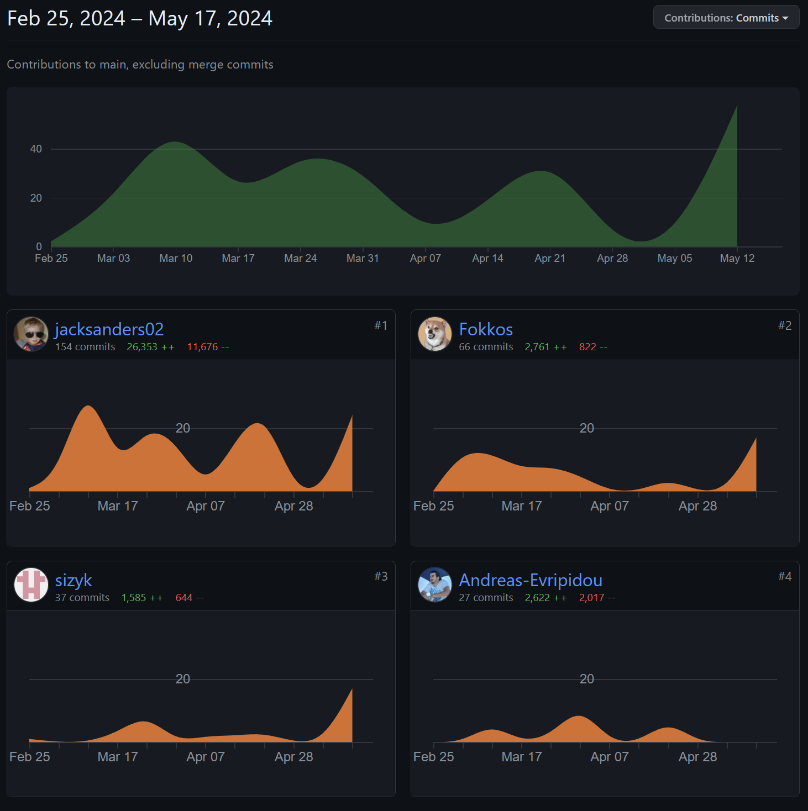

## Stories Completed

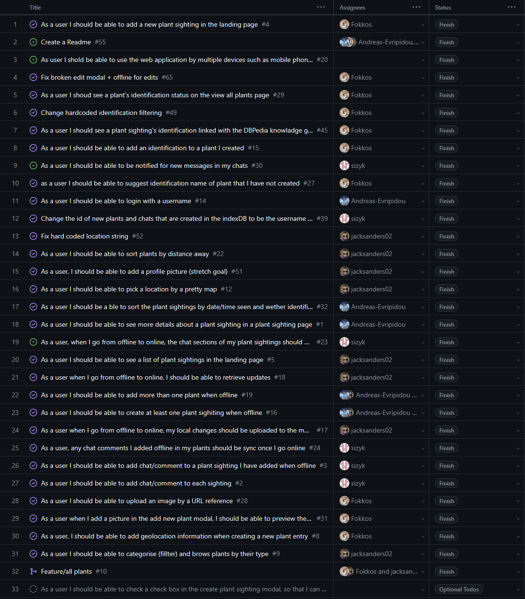

## Repository Link
The repository can be found [here](https://github.com/sizyk/COM3504-Team30.git)